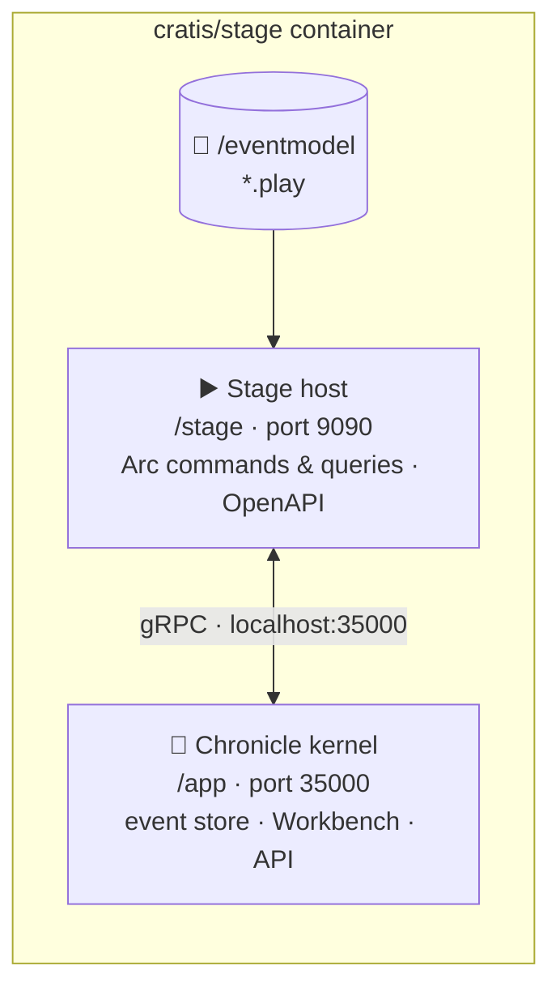

`cratis/stage` is a **play sandbox**: one container holding everything needed to perform an event model. There
is no database to provision, no Chronicle server to point at, and nothing left behind when it stops. That is
deliberate — a play session is meant to be started, poked at, and thrown away.

```bash
docker run --rm -p 9090:9090 -p 35000:35000 -v "$PWD":/eventmodel cratis/stage:latest
```

## What is inside

The image is built **on top of the Chronicle kernel image** (`cratis/chronicle`), so the event store and the
engine performing the model live side by side and talk over localhost:



Two things about that base image are worth knowing:

- **Storage is fully in-memory.** The MongoDB install the Chronicle image ships with is purged from the layer and
  the kernel is started with `Cratis__Chronicle__Storage__Type=InMemory`. The image carries no database, and
  every session starts empty.
- **The Stage host is a framework-dependent publish copied in, not compiled in the Docker build.** The
  `dotnet publish` output is produced on the host (by `dockerize.sh` or the publish workflow) and only copied
  into the image, because portable IL does not need to be recompiled per architecture.

## How it boots

`entrypoint-stage.sh` runs both processes in order:

1. **Start the Chronicle kernel** from `/app` with in-memory storage, and with its API and Workbench features
   turned on explicitly.
2. **Wait for the kernel** — it polls port `35000` until the gRPC endpoint accepts connections, so the Stage
   never races ahead of the event store it needs.
3. **Look for the model.** If no `.play` file exists anywhere beneath `/eventmodel`, the container **fails with
   an error instead of starting an empty API** — an empty stage is a configuration mistake, not a valid session.
4. **Start the Stage host** against `/eventmodel`. It compiles every `.play` file beneath the folder (the
   `**/*.play` glob), merges them into a single event model, and materializes the model's commands, queries, read
   models and projections. The projections are registered with Chronicle once the host has started.

Each session gets a generated, Docker-style event store name (`brave-mendel`, `nifty-turing`, …), which is what
you will see in the log line the host prints and in the Workbench.

## Ports

| Port | Protocol | What it serves |
|---|---|---|
| `9090` | HTTP | The model's API — commands, queries, OpenAPI and the Scalar reference. See [URLs of a running Stage](../reference/urls.md). |
| `35000` | HTTPS | The Chronicle kernel: gRPC (HTTP/2) for the Stage's own client, plus the **Chronicle Workbench**, its API and OAuth (HTTP/1.1) on the same port. |

Those two are all a caller needs. The kernel's remaining ports (Orleans clustering on `11111` and `30000`) are
internal to the container and can be ignored.

:::caution
**Port `35000` is HTTPS only — reach it as `https://localhost:35000`.** Kestrel can only serve HTTP/1.1 and
HTTP/2 on a single port over TLS, where ALPN negotiates the protocol per connection, so the kernel has no
plaintext mode for this port. A plain `http://` request to it gets no reply at all — `ERR_EMPTY_RESPONSE` in a
browser, `curl: (52) Empty reply from server` on the command line.

The certificate is a self-signed development one the kernel generates when none is configured, so a browser
warns the first time you open the Workbench, and command-line clients need `curl -k` (or the equivalent).
:::

## Mounting the model

The model is read from `/eventmodel` inside the container:

```bash
docker run --rm -p 9090:9090 -p 35000:35000 \
    -v /path/to/screenplays:/eventmodel \
    cratis/stage:latest
```

The folder is searched recursively, so a model split across many `.play` files in nested folders works as-is.
`/eventmodel` is a plain directory rather than a declared volume, which means a model can also be pushed in
through the container archive API instead of a bind mount — that is how tooling that has no host folder to share
(Studio, for one) supplies a model.

The host takes the model path as its first argument, so a different path is a matter of overriding the command:

```bash
docker run --rm -p 9090:9090 -v "$PWD":/models cratis/stage:latest dotnet Cratis.Stage.Host.dll /models
```

## Configuration

The host separates **hosting** defaults from **deployment** configuration:

| Source | Carries |
|---|---|
| `appsettings.json` / `appsettings.Docker.json` | Hosting defaults only — the Kestrel endpoint (`http://0.0.0.0:9090`) and the correlation-id (`X-Correlation-Id`) and tenant (`X-Tenant-Id`) HTTP headers. |
| `cratis-stage.json` | Deployment configuration, loaded from the content root if present. Optional, and reloaded on change. |
| `STAGE_CONFIG` | Overrides the path `cratis-stage.json` is read from — point it at a mounted file to configure a session without rebuilding the image. |

Anything Chronicle-related can also be set with the kernel's own environment variables
(`Cratis__Chronicle__…`), which is how the entrypoint pins in-memory storage and the Workbench.

## Building the images locally

Both Dockerfiles expect a prebuilt `dotnet publish` output, so build them through the script rather than calling
`docker build` directly:

```bash
./dockerize.sh
```

It publishes the host and the specification runner, then builds both images from the repository root. The host
image is tagged `cratis/studio-stage:latest` by default; `STAGE_IMAGE`, `STAGE_TAG`, `SPECRUNNER_IMAGE`,
`SPECRUNNER_TAG`, `VERSION`, `COMMIT` and `PLATFORM` override the defaults.
