A renderer target turns a compiled Screenplay executable semantic model into a complete, reviewable set of target artifacts. Build one when Screenplay models should produce code for another framework or platform without adding target-specific semantics to Screenplay or Stage's shared contracts.

```mermaid
flowchart LR
    Play[Screenplay files] --> Compile[SemanticModelCompiler]
    Compile --> ESM[Executable semantic model]
    ESM --> Execute[SemanticExecutionPlan]
    Execute --> Admit[Target admission]
    Admit --> Plan[IArtifactRenderPlanner]
    Plan --> Artifacts[ArtifactRenderPlan]
    Artifacts --> Publish[Managed publisher]
```



Rendering is the opposite direction from source recovery. A source adapter such as `IDotNetScreenplayAdapter` recovers source into Screenplay; an `IArtifactRenderPlanner` realizes Screenplay as target code. Do not interpret source-adapter facts as renderer inputs.

## Use the public contracts

Reference:

- `Cratis.Screenplay` for `ExecutableSemanticModel`, semantic identities, and `SemanticExecutionPlan`;
- `Cratis.Stage.Contracts` for `ArtifactRenderRequest`, profiles, scopes, planned artifacts, and diagnostics;
- target framework packages only from the target integration and generated-code verification projects.

The renderer extension surface is the contracts under `Cratis.Stage.Contracts.Rendering`. The Cratis renderer is a useful behavioral example, but its admission classes, semantic indexes, naming code, emitters, scaffold conventions, and other internal helpers are Cratis implementation details. They are not reusable renderer APIs. Build target-owned equivalents around the public contracts rather than taking a dependency on `Cratis.Stage.Rendering.Cratis`.

## Compile Screenplay before calling the planner

Compilation belongs to the caller or orchestration layer, not the target planner. Compile every file in one logical application through `SemanticModelCompiler`. Stable document keys establish identity; display paths provide diagnostic context and must not establish identity.

```csharp
using System.Collections.Immutable;
using Cratis.Screenplay.Semantics;
using Cratis.Screenplay.Semantics.Execution;

var applicationName = "Projects";
var catalog = SemanticIdentityCatalog.Empty(
    ApplicationIdentity.Create(applicationName));
var documents = new[]
{
    (StableKey: "concepts", Path: "Concepts.play", Text: File.ReadAllText("Concepts.play")),
    (StableKey: "registration", Path: "Projects/Registration.play", Text: File.ReadAllText("Projects/Registration.play"))
}.Select(source => SemanticSourceDocument.Create(
    catalog.ResolveDocument(source.StableKey),
    source.StableKey,
    source.Path,
    source.Text)).ToImmutableArray();

var documentSet = SemanticDocumentSet.Create(documents, catalog);
var compilation = new SemanticModelCompiler().Compile(
    applicationName,
    documentSet);
if (!compilation.Success)
{
    foreach (var diagnostic in compilation.Diagnostics)
    {
        Console.Error.WriteLine($"{diagnostic.Code}: {diagnostic.Message}");
    }

    return;
}

var model = compilation.Value!.Model;
var execution = SemanticExecutionPlan.Compile(model);
if (!execution.Success)
{
    foreach (var issue in execution.Issues)
    {
        Console.Error.WriteLine($"{issue.Kind}: {issue.Details}");
    }

    return;
}

var executionPlan = execution.Plan!;
```

Do not create an `ArtifactRenderRequest` until both phases succeed. The execution plan is a capability-admitted view of the same model, and `ArtifactRenderPlan.Create(...)` rejects a request when `request.ExecutionPlan.Revision` differs from `request.Model.Revision`.

The portable execution plan deliberately supports a narrower executable subset than the complete semantic model. A target must honor execution-plan issues and must not reparse Screenplay syntax or names to bypass them. If a target needs semantics that are not present, keep that behavior unsupported until Screenplay exposes an additive executable contract.

## Keep diagnostic ownership clear

Each phase owns its failures:

1. `SemanticModelCompiler` owns source, parse, binding, and semantic diagnostics in `compilation.Diagnostics`.
2. `SemanticExecutionPlan.Compile(...)` owns portable execution-capability issues in `execution.Issues`.
3. The target planner owns profile-admission, target-capability, and target-emission diagnostics in `ArtifactRenderPlan.Diagnostics`.
4. The publisher owns destination safety, ownership, recovery, and write failures.

Do not copy compiler diagnostics or execution issues into target diagnostic codes. Orchestration can map all three diagnostic types into one presentation model, but each phase's native code or issue kind, details, severity when present, and location or semantic identity remain authoritative.

Use `ArtifactRenderDiagnostic` for an unsupported but valid request. Use stable, target-owned codes and attach the affected `SemanticId`; use the default identity only for a genuinely application-wide diagnostic.

```csharp
static ArtifactRenderDiagnostic Unsupported(
    string message,
    SemanticId artifact) => new(
        "ACME-RENDER-002",
        ArtifactRenderDiagnosticSeverity.Error,
        message,
        artifact);
```

An `Error` makes `ArtifactRenderPlan.Success` false. `Information` and `Warning` do not. Invalid contract construction, such as a malformed scope, a traversing artifact path, or colliding output paths, throws `InvalidArtifactRenderContract`; those are programmer or integration errors rather than unsupported target semantics.

## Define and admit an exact target profile

`ArtifactRenderProfile` records all realization choices that can change output. At minimum, version:

- the stable target identity and exact target profile version;
- the stable renderer identity and exact renderer version;
- the target framework or package generation;
- projection, persistence, concept, and optional transport conventions;
- every scaffold, template, configuration, or schema input that affects artifacts.

Resolve input bytes before planning. Do not derive versions or templates from ambient packages, the destination, or the machine running the renderer.

```csharp
using System.Collections.Immutable;
using System.Text;
using Cratis.Stage.Contracts.Rendering;

var projectInput = ArtifactRenderInput.Create(
    "project-file",
    "1",
    ImmutableArray.CreateRange(Encoding.UTF8.GetBytes(
        "{\n  \"name\": \"generated-application\"\n}\n")));

var profile = ArtifactRenderProfile.Create(
    target: "acme",
    targetVersion: "3.2.0",
    renderer: "acme-code",
    rendererVersion: "1.0.0",
    inputs: [projectInput]);
```

`ArtifactRenderInput.Create(...)` validates the name and version, stores immutable bytes, and computes a lowercase SHA-256 hash. `ArtifactRenderProfile.Create(...)` rejects duplicate name-and-version pairs and orders inputs by ordinal name and version.

The planner must still admit the profile. Match all four identity/version fields and an exact input roster. Reject missing, extra, renamed, or unexpectedly versioned inputs with a target diagnostic. Do not use `Single()` or `SingleOrDefault()` on unadmitted input so a wrong profile cannot turn into an incidental exception.

```csharp
static bool Supports(ArtifactRenderProfile profile)
{
    if (!string.Equals(profile.Target, Target, StringComparison.Ordinal) ||
        !string.Equals(profile.TargetVersion, TargetVersion, StringComparison.Ordinal) ||
        !string.Equals(profile.Renderer, Renderer, StringComparison.Ordinal) ||
        !string.Equals(profile.RendererVersion, RendererVersion, StringComparison.Ordinal) ||
        profile.Inputs.Length != 1)
    {
        return false;
    }

    var input = profile.Inputs[0];
    return string.Equals(input.Name, "project-file", StringComparison.Ordinal) &&
        string.Equals(input.Version, "1", StringComparison.Ordinal);
}
```

Accepted input bytes must be parsed or copied deterministically wherever they affect output. `ArtifactRenderPlan` carries target and renderer versions but does not repeat input provenance, so the target's profile contract and support matrix must document the accepted roster.

### Localized Cratis validation messages

Screenplay retains `$strings.<key>` in the ESM as a **key**, not display text. If a model uses these messages on command or concept validation rules or command `require` guards, pass its companion `.strings` file contents to the additive `CratisRendering.CreateProfile(applicationName, options, scene, stringsFiles, defaultLocale)` overload. `stringsFiles` maps relative `<base>.<locale>.strings` paths (using `/`, not `\`) to original file contents; choose an explicit `defaultLocale` present in that set. Locale tags are checked syntactically without consulting the planner host's installed culture data. The generated application must run with culture data (such as ICU) that supports the selected locales; it resolves them at startup. The caller reads files **before** planning; the planner only consumes validated, hashed profile bytes. Without the optional catalog, `STAGE-ESM-002`/`STAGE-ESM-005` still reject these messages.

```csharp
var profile = CratisRendering.CreateProfile(
    model.Application.Name,
    new CratisRenderingOptions("Invoices", "Invoices"),
    scene: null,
    stringsFiles: new Dictionary<string, string>
    {
        ["invoicing.en.strings"] = "invoices.reasonRequired = \"Reason is required\"\n",
        ["invoicing.nb.strings"] = "invoices.reasonRequired = \"Begrunnelse kreves\"\n"
    },
    defaultLocale: "en");
var request = new ArtifactRenderRequest(
    model,
    executionPlan,
    profile,
    new ArtifactRenderScope(ArtifactRenderScopeKind.Application, model.Application.Id));
var plan = new CratisArtifactRenderPlanner().Plan(request);
```

The profile validates file names and assignments with Screenplay's `StringsFile.Parse`, merges disjoint keys by locale, and rejects duplicate keys and locale tags that differ only by case rather than depending on discovery order. It emits `GeneratedStrings.cs` from the catalog contents. With a catalog, generated `Program.cs` enables ASP.NET Core request localization before Arc, so the request's `Accept-Language` UI culture reaches validators while the formatting culture remains invariant. Generated validators resolve text at **validation time** using `CultureInfo.CurrentUICulture`: first the requested locale, then its parent locales, then the declared default. A missing translation in a non-default locale falls back; a referenced key absent from the default locale blocks planning with `STAGE-ESM-018` and **zero artifacts**. Referenced values containing braces (FluentValidation message placeholders) fail with `STAGE-ESM-018` instead of silently changing the text. Control characters and surrogate code units in **any** catalog value cause `CreateProfile` to throw `InvalidCratisBackendApplicationScaffold`, even if no rule references the key; this also excludes emoji represented by surrogate pairs. Line separators (U+2028 and U+2029) and other non-printable characters that the catalog accepts are escaped in generated C# string literals. Arc's validation-result `Message` contains localized text; `State` retains the original `$strings.<key>`. Generated `then error "$strings.<key>"` specifications assert `State`, matching the reference evaluator's key comparison rather than pinning a process locale. Literal and generated-default messages remain unchanged. This is a backend validation-message realization, not a general-purpose strings resolver for screen labels or constraint errors.

## Implement a pure planner

`IArtifactRenderPlanner.Plan(...)` is a pure planning boundary. Given the same immutable request, it must return the same plan or the same contract failure. It must not:

- read or write files;
- start a compiler, formatter, package manager, or other process;
- use the network;
- read the clock, random values, environment variables, current directory, or machine identity;
- inspect installed or workspace dependencies;
- mutate the semantic model, execution plan, profile, or profile input bytes.

```csharp
using Cratis.Screenplay.Semantics;
using Cratis.Stage.Contracts.Rendering;

namespace Acme.Screenplay.Rendering;

public sealed class AcmeArtifactRenderPlanner : IArtifactRenderPlanner
{
    public const string Target = "acme";
    public const string TargetVersion = "3.2.0";
    public const string Renderer = "acme-code";
    public const string RendererVersion = "1.0.0";

    public ArtifactRenderPlan Plan(ArtifactRenderRequest request)
    {
        var diagnostics = new List<ArtifactRenderDiagnostic>();
        var artifacts = new List<PlannedArtifact>();

        if (!Supports(request.Profile))
        {
            diagnostics.Add(new(
                "ACME-RENDER-001",
                ArtifactRenderDiagnosticSeverity.Error,
                "The request does not match the supported target, renderer, versions, and input roster.",
                request.Model.Application.Id));

            return ArtifactRenderPlan.Create(request, [], [.. diagnostics]);
        }

        var selected = SelectScope(request);
        diagnostics.AddRange(Admit(request, selected));
        if (diagnostics.Any(_ => _.Severity == ArtifactRenderDiagnosticSeverity.Error))
        {
            return ArtifactRenderPlan.Create(request, [], [.. diagnostics]);
        }

        artifacts.AddRange(Emit(request, selected));
        if (request.Scope.Kind == ArtifactRenderScopeKind.Application)
        {
            artifacts.Add(PlannedArtifact.CreateBinary(
                "project.json",
                request.Profile.Inputs[0].Bytes));
        }

        return ArtifactRenderPlan.Create(
            request,
            [.. artifacts],
            [.. diagnostics]);
    }

    // Supports, SelectScope, Admit, and Emit are deterministic target-owned code.
}
```

The sample shows the sequencing, not reusable helper APIs. `SelectScope`, `Admit`, and `Emit` are target-owned functions that you implement against the public semantic and rendering contracts.

## Admit target semantics before emission

Create one target-owned admission phase. Evaluate the selected artifacts and all semantics reachable from them before emitting dependent files. Admission must decide whether the target can exactly realize:

- each reachable slice kind;
- command validation and authorization;
- produced-event destinations, conditions, and property mappings;
- projection transitions and affected-instance cardinality;
- query cardinality, delivery, keys, and authorization;
- concepts, composite types, optionality, and validation;
- executable specification values and expectations;
- target lifecycle, persistence, transport, and package choices.

Collect independent target diagnostics so an author can fix several issues in one pass. When a required semantic fails admission, do not emit its dependent artifacts. Never substitute thinner code, an unfinished implementation, an empty handler, a placeholder value, or a guessed default.

The Cratis renderer applies the same rule when emission reaches a semantic kind or value combination it has no rendering for, such as an unhandled slice kind, type-reference kind, or primitive, or a semantic value whose kind does not match its primitive type. Planning stops with a `STAGE-ESM-012` error attached to the application identity. The plan is unsuccessful and contains no artifacts, including scaffold files. The renderer does not fall back to `object` or `default!`, and it does not drop the slice. `STAGE-ESM-012` reports a renderer gap; it adds no executable semantic model capability, and Cratis admission remains narrower than the executable semantic model.

A model that uses an ESM v2 construct arrives as language and semantic version `2.0`. Admit it construct by construct rather than treating it as v1. The Cratis renderer handles the v2 constructs this way:

- **Typed destination.** A command appends to the event source named by `produces … for <property>`, and the identity is not copied into the event record. The rendered command provides that property as its event source id. When a produced event has no destination of its own, the command's typed destination applies, as it does in the Screenplay evaluator.
- **Specification event sources.** When a `given`, `when`, or `then` event states `for <value>`, the rendered specification seeds the given fact or asserts the appended event on that stream rather than on the command's destination value. In a specification that expects success, the stated sources must agree with each other, have the command destination's type, convert to a Chronicle event source id without losing identity (text or UUID), and have an expected event to assert them on. Otherwise the specification fails admission with `STAGE-ESM-011`. A rejection appends nothing, so a `when … for` on a rejection specification is admitted as is.
- **Command occurrence values.** A `$context.occurred` or `$context.identity.*` mapping fails admission with `STAGE-ESM-013`. Chronicle assigns the occurrence when it appends the event, so a Cratis command cannot put the same value in the event payload.
- **Scoped projections.** Supported `from`, `join`, `every`, `nested from`, `children`, and keyed root/child removal blocks render as fluent Chronicle projections. `STAGE-ESM-017` rejects conflicting event roles or keys, and nested `from` without a same-contract root `from` and identical key: Chronicle can otherwise create a partial root document when the reference evaluator would not. Nested `clear` and child join removal also fail admission: differential execution exposes a nested re-creation failure and a multi-parent deletion mismatch in Chronicle's in-memory projection sink. Do not claim those shapes are portable without an engine-backed fix and a passing differential check.

The Cratis renderer also rejects guarded productions and event tags (`STAGE-ESM-006`). Portable single-text-property and unique event-occurrence constraints render as named Chronicle constraints, including multiple event targets, releases, casing, and messages. A constrained command input receives a not-null validator; optional, composite, and nontext property keys and commands producing multiple target or release events in one batch fail admission (`STAGE-ESM-014`): Chronicle #4122 indexes null incorrectly, its string hashing cannot preserve every typed/composite value, and its batch claims do not follow the reference's intra-command release/replacement behavior. Specifications with givens that violate a constraint fail with `STAGE-ESM-011`; accepted and rejected generated specs seed relevant givens through the event log and assert committed events separately from failed append attempts. Chronicle #4123 means index-update failures after commit currently cannot provide an atomicity guarantee. Portable policy expressions on commands and queries render as registered Arc authorization policies when the expression itself requires authentication. Arc's `[Authorize]` always requires an authenticated principal; a role- or claim-only expression that could permit an unauthenticated caller therefore fails admission (`STAGE-ESM-015`) rather than changing the model's meaning. Screenplay `csharp`/`file` policy attachments enter ESM v3 as opaque requirements; policies referenced by a rendered command or query remain unsupported (`STAGE-ESM-015`). The diagnostic names the missing `PolicyContext.Occurred` received-at value at Arc's authorization boundary; the request can now carry and verify the attachment. Stage does not substitute the policy evaluation time for the received-at time or turn an opaque predicate into a denial. For keyed queries, `PolicyContext.Subject` is already defined by Screenplay as the single query key; Stage's portable `claim … matches subject` uses that same keyed argument. Portable caller fixtures and `then denied` run against the generated policy and check its registration; claims using the role claim URI fail admission (`STAGE-ESM-011` for fixtures, `STAGE-ESM-015` for policies) because Arc merges them with roles while Screenplay keeps them distinct. Without these admission checks, the application could append events the reference evaluator rejects, tag them differently, or let unauthorized callers through.

ESM v3 (`3.0` language and semantic versions) adds implementation attachments. `SemanticModelLoader.LoadFromPathAsync` loads referenced files from the model root using Screenplay's `AttachmentFiles.Load`; it carries inline and file bodies by requirement id in `LoadedSemanticModel.ImplementationContents` and compiler metadata in `ImplementationRequirements`. A pure `ArtifactRenderRequest` can carry both via its additive init properties, or callers can use the additive `CratisRendering.Plan(model, executionPlan, scope, options, requirements, contents)` overload. The planner checks every supplied body against the requirement's SHA-256 `ContentHash`; an unresolved, absent or mismatched body fails with `STAGE-ESM-020` naming the requirement, without emitting artifacts. Do not supply file paths as content identities or reuse bodies from a previous compilation.

Stage still rejects command code validations, named rule predicates, and concept code validations (`STAGE-ESM-005`): Arc's validator boundary does not supply the command's exact `RuleContext.Tenant`, `RuleContext.CausedBy`, or received-at `RuleContext.Occurred`. In particular, using the validation clock or a default caller would change what code can observe. Reducers still fail `STAGE-ESM-019` pending Screenplay's per-transition typed State/Event descriptor (decision 0012); opaque policies fail `STAGE-ESM-015` pending the received-at value at Arc's authorization boundary. A plan that rejects a body emits no artifacts. A v3 model with only an unreferenced opaque policy and no reducers renders the same selected slice bytes as v2. The in-memory runtime and specification executor leave a reached opaque policy unsupported (Authorization capability), preserving left-to-right short-circuit outcomes rather than guessing allow or deny. The in-memory runtime and specification executor leave a reached opaque policy unsupported (Authorization capability), preserving left-to-right short-circuit outcomes rather than guessing allow or deny. Unknown version pairs still fail `STAGE-ESM-016`.

Build target-local indexes keyed by `SemanticId`. Use `ExecutableSemanticModel` and `SemanticExecutionPlan` mappings for command production, destinations, properties, projection transitions, affected-instance keys, queries, and typed specification values. Never join artifacts by a short or display name.

## Apply scope semantics consistently

`ArtifactRenderScopeKind` has four admitted values:

- `Application` selects the entire application;
- `Module` selects one module and everything below it;
- `Feature` selects one feature and everything below it, including nested features;
- `Slice` selects one slice.

The accompanying `ArtifactRenderScope.Artifact` must be the matching semantic identity in `request.Model`. `ArtifactRenderPlan.Create(...)` rejects unknown kinds, unset identities, an application scope with the wrong application identity, and module, feature, or slice identities outside the model.

Selection and dependency closure remain target responsibilities. Define whether a narrow scope emits:

- a compilable closure containing every referenced common and target artifact; or
- an intentionally incomplete review fragment.

Do not call a fragment compilable. Admission must include every semantic dependency required by the documented policy. Application scope normally includes application-wide configuration, scaffolding, and common types; narrower scopes should not silently acquire destination-dependent files.

Any artifact present in two scopes must have the same normalized path, kind, and exact bytes. Scope changes selection only; they must not change how the same artifact is rendered.

## Produce deterministic artifacts

Create every output in memory with the public factories:

```csharp
var source =
    "export interface RegisterProject {\n" +
    "    name: string;\n" +
    "}\n";

var artifact = PlannedArtifact.CreateText(
    "src/register-project.ts",
    source);
```

`PlannedArtifact.CreateText(...)` normalizes CRLF and CR to LF, encodes UTF-8 without a byte-order mark, and computes a lowercase SHA-256 hash. `PlannedArtifact.CreateBinary(...)` preserves exact bytes and hashes them.

`ArtifactRenderPlan.Create(...)` then:

- verifies the model/execution-plan revision and scope;
- revalidates and normalizes artifact paths;
- orders artifacts by ordinal relative path;
- rejects duplicate paths and case-insensitive collisions;
- deterministically orders diagnostics by severity, code, semantic identity, and message;
- copies target, renderer, application, and semantic revision metadata into the plan.

Artifact paths must be slash-separated and relative. Rooted paths, drive-qualified paths, empty segments, `.`, and `..` are invalid.

The target must also make its own emission deterministic:

- order declarations by stable semantic identity or another documented stable key;
- sort every dictionary, set, and filesystem-derived input before it reaches the request;
- never let enumeration order choose semantics or resolve a conflict;
- keep physical workspace roots and publication destinations out of content;
- resolve all templates and package versions into the profile before planning;
- avoid timestamps, generated random identifiers, machine-specific headers, and formatter-version drift.

The Cratis renderer orders read-model parameter declarations, generated constructor arguments, and assertions by ordinal semantic ID so serializing and deserializing the model does not change artifact bytes. This can change positional record parameter order in directly source-generated output from source declaration order; the captured route already uses canonical order.

A plan describes destination-independent bytes. Publication, staging, stale-file removal, recovery, and overwrite policy belong after successful planning.

## Verify the generated code

Deterministic bytes do not prove that a target toolchain accepts the generated application. Add target-owned verification that:

1. creates a request from trusted Screenplay fixtures and an exact profile;
2. requires successful compilation, execution-plan admission, and target planning;
3. materializes the plan's exact bytes into a fresh temporary directory without rewriting or formatting them;
4. verifies each materialized file against the planned SHA-256;
5. restores only exact pinned target dependencies from trusted sources;
6. runs the target compiler or build with warnings treated as errors;
7. runs focused target-framework tests where compilation cannot prove behavior;
8. repeats in a clean environment to expose ambient dependency assumptions.

Keep formatting and code generation inside the pure planner. A verifier that reformats or patches generated files is testing different artifacts from those in the plan.

Treat generated build definitions as code execution. Verify trusted fixtures in an isolated environment, and do not execute package scripts or build targets from untrusted profile inputs.

## Specify the renderer

At minimum, add specifications for:

1. exact target, renderer, version, and profile-input admission;
2. missing, extra, malformed, or wrong-version profile inputs failing closed;
3. every supported semantic form producing expected paths, kinds, bytes, and hashes;
4. unsupported reachable semantics producing target errors and no dependent artifacts;
5. compiler diagnostics and execution issues remaining owned by their upstream phases;
6. reversed semantic and profile-input enumeration producing byte-identical plans;
7. repeated planning producing byte-identical plans without filesystem, process, network, clock, or environment effects;
8. application, module, feature, and slice scope selection and dependency policy;
9. shared artifacts having identical paths and bytes across scopes;
10. rooted, drive-qualified, empty-segment, and traversing paths being rejected;
11. duplicate and case-insensitive-colliding paths being rejected;
12. changed accepted input bytes deterministically changing every affected artifact;
13. specifications rendering from typed semantic values without string guessing;
14. the exact generated package closure compiling against pinned versions.

Golden files are useful for review, but assert the plan metadata and diagnostics as well as source text. Add invariance tests that perturb input order; one successful snapshot does not prove determinism.

## Integrate through the CLI's static roster

The Cratis CLI uses a static, reviewed roster of bundled targets. It does not discover arbitrary renderer packages from the analyzed workspace. The current CLI wrapper contract and roster are internal CLI implementation seams, not a public plugin API.

To bundle a target, coordinate a CLI change that:

1. adds a target package reference and an internal target wrapper under `cli/Source/Cli/Commands/Render`;
2. gives the wrapper a stable command-line target name;
3. constructs the exact immutable profile and resolved inputs;
4. calls the target planner with the admitted model and execution plan;
5. explicitly adds the wrapper to `RenderTargetRoster`;
6. adds target selection, profile, package-closure, plan, and publication specifications;
7. passes successful plans to the existing managed artifact publisher.

The current CLI command requests application scope. Module, feature, and slice scopes are public planner-contract capabilities, but users cannot select them until the CLI adds explicit command support.

Preserve the static roster. Workspace plugin loading would execute code across a larger trust boundary and allow unreviewed dependency and target-version conflicts.

## Document the support contract

Publish a target support matrix that distinguishes:

- supported Screenplay semantic forms;
- blocked forms and their target diagnostic codes;
- exact target, renderer, compiler, runtime, and package versions;
- exact profile inputs and defaults;
- scope and dependency-closure behavior;
- generated artifact layout and text conventions;
- generated-code verification fixtures;
- known non-bijective source-recovery concerns.

A source adapter recovering generated code can be an additional regression oracle, but it cannot prove behavioral equivalence. Target realization choices that Screenplay does not express will not round-trip.

## Implementation checklist

Before declaring a target ready:

- [ ] Compile the complete logical application with stable document keys.
- [ ] Stop on compiler diagnostics or execution-plan issues before target planning.
- [ ] Define stable target and renderer identities with exact versions.
- [ ] Resolve and hash every external input before creating the profile.
- [ ] Admit the exact profile roster and fail closed on every mismatch.
- [ ] Implement scope selection and document narrow-scope dependency behavior.
- [ ] Index and join semantics by `SemanticId`, never display names.
- [ ] Admit all selected and reachable semantics before dependent emission.
- [ ] Keep `Plan(...)` free of filesystem, process, network, clock, random, and ambient-state access.
- [ ] Emit all artifacts in memory through `PlannedArtifact` factories.
- [ ] Make ordering, names, paths, text encoding, line endings, and hashes deterministic.
- [ ] Preserve diagnostic ownership and use stable target-owned codes.
- [ ] Verify profile, admission, scope, collision, and determinism behavior with specifications.
- [ ] Materialize and compile the exact generated bytes against pinned target dependencies.
- [ ] Document the support matrix, profile, artifact layout, diagnostics, and verification environment.
- [ ] Add the target to the CLI only through its reviewed static roster.

## Public API reference

The renderer-facing public contracts are defined in:

- `Source/Contracts/Rendering/IArtifactRenderPlanner.cs`
- `Source/Contracts/Rendering/ArtifactRenderProfile.cs`
- `Source/Contracts/Rendering/ArtifactRenderPlan.cs`

Use the Screenplay `SemanticModelCompiler` and `SemanticExecutionPlan` APIs shown above to build the request. Renderer-specific files under `Source/Rendering.Cratis` can illustrate one target's decisions, but they are not a shared helper library or an extension contract for other targets.
