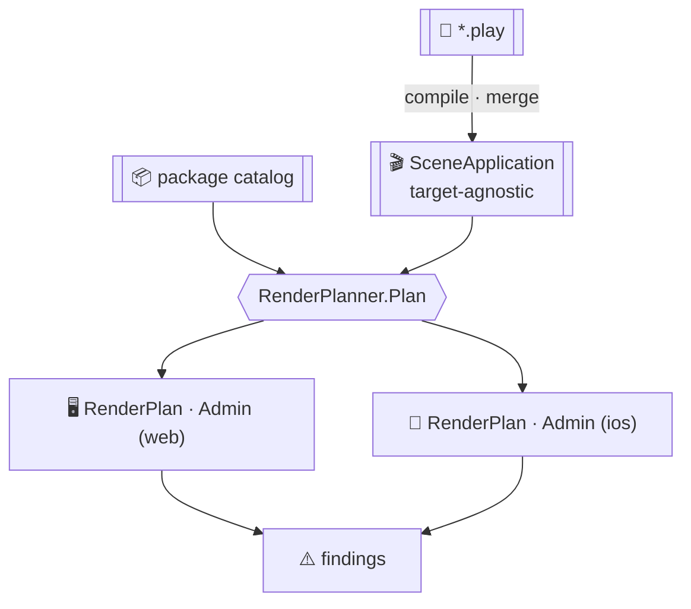

A Screenplay application is deliberately target-agnostic. A `screen` names components and slots; it never names
a package, a theme or a shell. That is what makes the same screen work on the web and on a phone — and it means
something has to decide, per target, which component vocabulary is active, which shell is in force, which theme
applies, and how everything lays out. A **render plan** is that decision, made once per target, before anything
is emitted.

A plan is produced from a `ui profile`. Each one names its platforms, its packages, and the shell and theme it
selects:

```screenplay
ui profile Admin
  target platform web, ios
  layout AppShell
  theme Aurora

  packages
    PrimeReact
```

## What a plan is resolved against

Every resolution rule a plan applies comes from `Cratis.Scene.Engine` — the same engine a running Scene renderer
uses. Stage sequences the calls and reports what they return; it implements no breakpoint, priority or variant
rule of its own, so a plan and a running application can never disagree about what a screen resolves to.



The catalog is the one input a `.play` file cannot supply. A profile lists package *names*; the declarations
behind those names — what each package contains, depends on and ships — live outside the document, so the caller
passes them in as `ScenePackage` records.

## Producing a plan

`EventModelLoader` compiles the model and resolves it in one call:

```csharp
using Cratis.Scene.Model.Packages;
using Cratis.Stage.Contracts;
using Cratis.Stage.Contracts.Scene;

IReadOnlyList<ScenePackage> catalog =
[
    new ScenePackage("core", "1.0.0", PackageKind.ComponentLibrary, [], ["core:title", "core:table"], [], [], [], []),
    new ScenePackage("Tailwind", "3.0.0", PackageKind.Styling, [], [], [], [], [], []),
    new ScenePackage("PrimeReact", "1.2.0", PackageKind.ComponentLibrary, [new PackageDependency("Tailwind")], ["core:table"], [], [], [], ["Aurora"]),
];

var plan = await EventModelLoader.LoadRenderPlanFromDirectoryAsync("./model", catalog);

foreach (var target in plan.Targets)
{
    Console.WriteLine($"{target.Profile.Name} ({target.Profile.TargetPlatform}): {string.Join(", ", target.Profile.Packages)}");

    foreach (var finding in target.Findings)
    {
        Console.WriteLine($"  {finding.Kind}: {finding.Message}");
    }
}

if (!plan.IsComplete)
{
    Console.Error.WriteLine("Some targets did not fully resolve.");
}
```

When you already hold a translated application — because you are also inspecting the screens, or planning the
same model against more than one catalog — plan it directly:

```csharp
var application = await EventModelLoader.LoadSceneApplicationFromDirectoryAsync("./model");
var plan = RenderPlanner.Plan(application, catalog);
```

Both throw `InvalidEventModel` when the source does not *compile*. Nothing that happens after that point
throws — see [Findings](#findings) for why.

## What a plan contains

`ApplicationRenderPlan` carries one `RenderPlan` per target in `Targets`, plus `Findings` for anything wrong
with the application as a whole, and `IsComplete` when nothing anywhere was left unresolved.

Each `RenderPlan` carries:

| Member | What it holds |
| --- | --- |
| `Profile` | The target, with `Packages` replaced by the resolved transitive closure in ascending override-priority order — the list every other member was resolved against. |
| `Packages` | The `PackageSelection` behind that list: what was `Added` on the target's behalf, and any `Missing`, `VersionConflicts` and `Cycles`. |
| `LayoutName` | The name of the shell this target renders inside, or `null` when nothing in scope declares the one it selects. |
| `Layout` | The shell's structure, when the application declares it. `null` with a `LayoutName` set means an active package provides the shell — a catalog carries names, never structures. |
| `Theme` | The theme this target applies, or `null` when it selects none. |
| `ThemePackages` | The active packages the theme's tokens actually apply to, so a renderer scopes tokens instead of applying them globally. |
| `SizeClass` | The size class the arrangements below were evaluated at — the target's `target size`, or the class Scene's own calculator yields at its default breakpoints when the target declares none. |
| `Components` | One `ComponentResolution` per component name the application references, naming the package it resolved to and every package that also declared the name but was shadowed. |
| `ScreenTemplates` | The `ScreenTemplateResolution`: where each screen template nests inside `Layout`, and anything `Unplaced` or in a cycle. |
| `Arrangements` | One `ArrangementSelection` per slot-bearing structure: the flow tree, slot variant or element variant that applies at `SizeClass`. |
| `Findings` | Everything this target could not fully resolve. |
| `IsComplete` | Whether `Findings` is empty. |

## Findings

A finding is reported, never thrown. Resolution keeps going and the plan comes back complete with everything
that *did* resolve, so one pass shows every problem across every target rather than stopping at the first — and
so your build decides which findings are fatal.

This is deliberately a different mechanism from a compile error. Screenplay's compiler answers "is this source
valid?", and Stage throws `InvalidEventModel` when the answer is no. A finding answers a question the source
alone cannot: "is this valid source *enough* for this particular target?". It belongs to a target, not to a span
of text, which is why it lives on the plan.

| Kind | What it means |
| --- | --- |
| `NoTargetDeclared` | The application declares no `ui profile`, so there is no deployment target to render for. |
| `PackageNotInCatalog` | A package the target activates has no declaration in the catalog, so nothing it contributes can be resolved. Includes `core`, which is always active as the final fallback. |
| `PackageDependencyMissing` | A package the target activates depends on a package nothing in the catalog satisfies. |
| `PackageVersionConflict` | A dependency resolved by name, but to a version its declared range does not accept. |
| `PackageDependencyCycle` | Packages depend on each other, so no override priority exists between them and name collisions have no defined winner. |
| `LayoutNotFound` | The target selects a shell neither the application nor any package it activates declares. |
| `ScreenNotOnSelectedLayout` | A screen resolved against a different shell than this target selects. A screen carries one layout name, so a target selecting another shell would render it somewhere it was never resolved for. |
| `ThemeNotFound` | The target selects a theme the application does not declare, so no tokens apply. |
| `ThemeIncompatible` | The theme is not declared compatible with a package the target activates — that package's components render unthemed or wrongly themed. |
| `ComponentNotResolved` | A component name the application references resolves against no active package: a hole in the screen where that component should be. |
| `ScreenTemplateUnplaced` | A screen template's `fits slot` names no single container — nothing declares that slot, or several do and the name is ambiguous. |
| `ScreenTemplateCycle` | Screen templates nest inside each other, so no tree can be built from them. |
| `SizeClassVariantMissing` | A freeform arrangement declares no variant for the size class this target renders at. Freeform has no fallback variant by design, so those slots have nowhere to go. |

## One invocation, one plan per target

An application ships several targets — a web app and a companion mobile app are two `ui profile`s, and a single
profile naming two platforms is two targets as well. Stage plans **all of them from one invocation**, and never
runs a build per target.

The targets come out of a single compile of a single `.play` source set. Planning them together is the only way
they are guaranteed to describe the same application; a build per target compiles the same source once per
target and can only compare the outcomes afterwards, if at all. It is also what makes "this template is
unplaceable on the phone but fine on the web" a question the build can answer at all, and what lets a build fail
once, coherently, with every target's findings in hand.

Planning together does not mean emitting together. `Targets` is a list and every entry is independently
emittable, so shipping the web bundle now and the mobile package later is a filter over the plan rather than a
second build:

```csharp
var mobile = plan.Targets.Where(target => target.Profile.TargetPlatform is "ios" or "android");
```

The split belongs at emission, where the artifacts genuinely differ — not back at compilation, where they do
not.

## What a plan does not decide

- **It emits nothing.** A plan is the resolved input an emitter consumes; producing a static web bundle or a
  native app package is a separate step.
- **It does not invent a catalog.** Pass one in. With no catalog, every package is unknown and every component
  name is unresolved, which the findings will say plainly.
- **It does not resolve a shell a package only names.** A catalog carries package names and the names of what
  they contribute, never structures — so a shell provided by a blueprint is named in the plan, and its
  arrangements and template placements are not part of it.
- **It does not push findings back into Screenplay's diagnostics.** Screenplay diagnostics describe source text
  and have no target to attribute a per-target outcome to.
