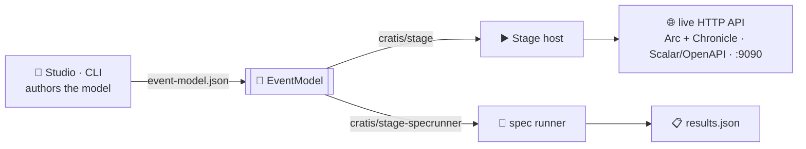

<div align="center">

# ▶️ Cratis Stage

**Hands an authored event model a stage and lets it perform — a live, running Cratis application at runtime. No code generation, no compilation: the model *is* the application.**

[](https://discord.gg/kt4AMpV8WV)
[](https://hub.docker.com/r/cratis/stage)
[](https://github.com/Cratis/Stage/actions/workflows/dotnet-build.yml)
[](https://github.com/Cratis/Stage/actions/workflows/publish.yml)
[](LICENSE)

</div>

---

A script isn't a show until someone performs it. Hand **Stage** an authored event model — the intermediate JSON
produced by [Cratis Studio](https://github.com/Cratis/Studio), the Cratis CLI, or any other tool — and it puts
the model on its feet: dynamically generated commands and queries (Arc), read models and projections
(Chronicle), and a Scalar/OpenAPI surface, all materialized **at runtime**. Nothing is generated to disk and
compiled; the model is interpreted and *performed*. Change the model, and the performance changes with it.

Stage is self-contained — it has **no dependency on Studio**. It's consumed as containers (the host and the
specification runner) and as a NuGet package (the contracts), from Studio, the Cratis CLI, or your own tooling.

## ▶️ Why "Stage"?

Three reasons, and they all line up:

- **The stage is where the script becomes a live show.** A screenplay is just paper until it's staged; the
  performance happens in front of a live audience — here, real HTTP callers hitting a running API. Stage is
  where the model stops being a document and starts *behaving*.
- **It performs, it doesn't print.** No code generation, no build step, no artifacts to check in — the model
  runs as-is. The stage is bare until the model steps onto it, and it leaves nothing behind when the curtain
  falls.
- **The Cratis storytelling family.** Cratis names its products after telling a story: **Chronicle** records
  what happened, **Arc** shapes the plot, **Screenplay** is the script, **Studio** storyboards it,
  **Narrator** reads it back… **Stage** is where the cast performs the script live. It joins the ensemble.

Hand the same model to **Studio** and it storyboards it — visualizing and generating. Hand it to **Stage** and
it performs it. One model; no meaning lost between the whiteboard and the running app.

## 🎬 One model, curtain up

The only thing Stage needs is a serialized `EventModel`. The types and the exact serialization live in
`Cratis.Stage.Contracts`, so consumers write the file with `EventModelFile.Write(model)` and never hand-roll
JSON:



At startup the host loads the model, stands up its commands, queries, read models, and projections, and
registers the projections with Chronicle so they run and populate the read-model store — a real event-sourced
application, materialized from JSON.

## 🎭 The cast (projects)

| Project | Package / Image | Purpose |
|---|---|---|
| `Source/Contracts` | `Cratis.Stage.Contracts` (NuGet) | The event model intermediate format (with its embedded JSON schema), specification run results, and the serialization for both (`EventModelFile`, `SpecificationRunResultsFile`, `StageJson`). |
| `Source/Stage` | `Cratis.Stage` (NuGet) | The engine — synthesizes commands, queries, validators, read models, and projections from a deserialized `EventModel` at runtime. |
| `Source/Host` | `cratis/stage` (Docker) | Self-contained play sandbox: MongoDB + Chronicle kernel + the Stage engine in one container. Mount a model at `/eventmodel`, get a live API on port `9090`. |
| `Source/SpecRunner` | `cratis/stage-specrunner` (Docker) | Run-to-completion job that loads an event model from the mounted `/model` folder, runs its specifications, and writes `results.json` to the mounted `/output` folder. |

## 🎟️ Consuming

```text
Studio / CLI ──(event-model.json)──▶ cratis/stage            ⇒ live HTTP API (port 9090)
Studio / CLI ──(event-model.json)──▶ cratis/stage-specrunner ⇒ results.json
```

- The **host** takes the model file path as its first argument (the container entrypoint finds it in
  `/eventmodel`). Deployment configuration is supplied through a dedicated `cratis-stage.json` file (path
  overridable with the `STAGE_CONFIG` environment variable) instead of `appsettings.json`.
- The **spec runner** takes `--model <file>` and `--output <file>`, with optional `--slice <guid>` /
  `--spec <guid>` filters; the container defaults to `/model/event-model.json` and `/output/results.json`.

## 🚀 Building

```shell
dotnet build                # Debug
dotnet test                 # run the specs
dotnet build -c Release     # Release — warnings are errors
```

Container images are built from the repository root:

```shell
docker build -f Source/Host/Dockerfile -t cratis/stage .
docker build -f Source/SpecRunner/Dockerfile -t cratis/stage-specrunner .
```

## ✅ Quality gates

```shell
dotnet build -c Release     # zero warnings, zero errors
dotnet test                 # all specs green
```

---

<div align="center">

*Part of the [Cratis](https://cratis.io) platform · Licensed under the [MIT license](LICENSE)*

</div>
