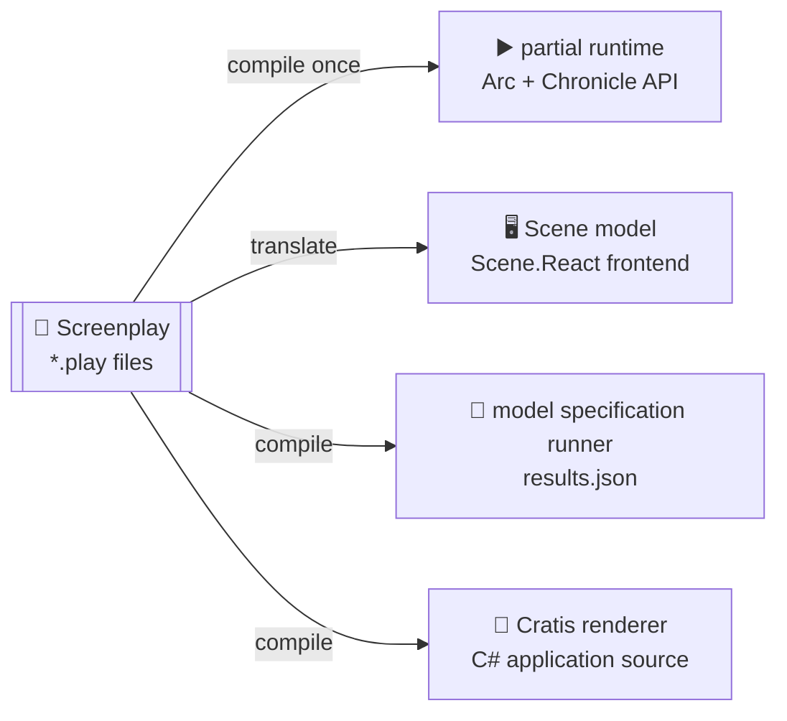

<!-- markdownlint-disable MD033 MD041 -->
<div align="center">

# ▶️ Cratis Stage

**Compiles Screenplay source, verifies modeled specifications, and renders or partially performs Cratis applications.**

[](https://discord.gg/kt4AMpV8WV)
[](https://hub.docker.com/r/cratis/stage)
[](https://github.com/Cratis/Stage/actions/workflows/dotnet-build.yml)
[](https://github.com/Cratis/Stage/actions/workflows/publish.yml)
[](LICENSE)

</div>

---

Stage has three responsibilities around a Screenplay application:

1. **Runtime** — provide a disposable host that directly performs the subset of modeled backend behavior Stage
   currently understands.
2. **Specification runner** — verify the specifications declared in the model and write structured results.
3. **Renderer** — turn compiled Screenplay syntax into a reviewable [Cratis Arc](https://github.com/Cratis/Arc) + [Chronicle](https://github.com/Cratis/Chronicle) application on disk.

The renderer is the project's highest-priority path. Direct runtime execution and specification verification are
useful, but partial; they must not be read as proof that every Screenplay construct has executable semantics.
The sandbox now serves a first web frontend by translating the same compiled Screenplay application to Scene and
rendering its screen elements with Scene.React. Layout/template composition, query-backed data, and command forms
remain incremental runtime work rather than being silently simulated.

Stage is part of the experimental Cratis model-first layer: [Screenplay](https://github.com/Cratis/Screenplay) is
the modeling language, [Studio](https://github.com/Cratis/Studio) the collaborative modeling environment,
[Scene](https://github.com/Cratis/Scene) the platform-neutral UI model, and
[Prologue](https://github.com/Cratis/Prologue) captures existing system behavior into event models. What Stage
renders is an event-sourced CQRS application built on Cratis Arc and Chronicle, the Cratis event-sourcing
database and runtime.

## Authoritative input

The authoritative input is Screenplay source: a `.play` file or a folder containing `.play` files. The host and
specification runner compile the selected file alone, or compile every `.play` file beneath the selected folder
as one application. Stage's contract models are internal/tooling seams produced from that compilation; an
`event-model.json` file is not the current startup or rendering contract.


```mermaid
flowchart LR
    Play[["📄 Screenplay<br/>*.play files"]]
    Play -->|compile once| Runtime["▶️ partial runtime<br/>Arc + Chronicle API"]
    Play -->|translate| Scene["🖥️ Scene model<br/>Scene.React frontend"]
    Play -->|compile| Specs["🧪 model specification runner<br/>results.json"]
    Play -->|compile| Renderer["🎨 Cratis renderer<br/>C# application source"]
```

Stage is independent of Studio. Studio, the Cratis CLI, and other tooling can supply the same Screenplay source
without Stage depending on any one authoring environment.

## Current scope

### Renderer — highest priority

Stage v1 has exactly one forward-rendering target: `cratis`. The `Cratis.Stage.Rendering.Cratis` package owns the
complete pure target policy through the `CratisRendering` facade: target `cratis`, renderer version `1`, exact
dependency pins, exact scaffold inputs, profile creation, and planning. The Cratis CLI and Studio's in-memory preview
must consume this facade with only the executable semantic model, execution plan, semantic scope, and explicit
project/root-namespace options; neither caller should copy target policy.

`CratisRendering.Plan(...)` returns the existing destination-independent `ArtifactRenderPlan` with normalized
paths, exact bytes, SHA-256 hashes, and typed diagnostics. Callers supply destination-independent project and root
namespace names; the facade derives every target, renderer, profile, package, and runtime version itself:

```csharp
var options = new CratisRenderingOptions("Projects", "Projects");
var scope = new ArtifactRenderScope(ArtifactRenderScopeKind.Application, model.Application.Id);
var plan = CratisRendering.Plan(model, executionPlan, scope, options);
```

`ProjectName` controls the project and solution file names; `RootNamespace` controls the project setting and
all generated semantic C# source, imports, and specification namespaces. For example,
`new CratisRenderingOptions("BackendHost", "Acme.projectAPI")` keeps that exact dotted namespace and casing,
even when the semantic application is named `Projects`. Module, feature, and slice plans use the same namespace
as the application plan. Neither the application display name nor a destination folder overrides this option.

The plan must be published only when `plan.Success` is `true`. A failed plan carries diagnostics and **no candidate
artifacts**. Callers that need the immutable package-owned profile for a lower-level `ArtifactRenderRequest` can use
`CratisRendering.CreateProfile(...)`; they must not reconstruct or modify it. The planner rejects changed identities,
versions, input rosters, bytes, and hashes.

The underlying `IArtifactRenderPlanner` performs no file system, process, network, environment, clock, or random
access. The currently admitted vertical includes concepts, composite types, one command/event production path,
one-instance projection state, an optional snapshot lookup, and modeled specifications. Unsupported reachable
semantics block publication instead of producing thinner code.

Generated state-change commands implement `ICanProvideEventSourceId` using the resolved semantic `produces for`
property, rather than property names or discovery order. Primitive String/Uuid destinations remain `string`/`Guid`;
identity concepts retain their implicit conversion, and other scalar destinations use Arc's `ToString()` value
semantics. Events are still appended through the event returned by `Handle()`. Generated acceptance specs assert
both the destination event-source ID and event payload. `Common` imports follow the types declared in each artifact
and the constructors actually emitted in command specification values, not unrelated application concepts.

Application scope adds exactly eight deterministic backend scaffold artifacts: `Directory.Build.props`,
`Directory.Build.targets`, `Directory.Packages.props`, the project and solution files, `Program.cs`,
`appsettings.json`, and `docker-compose.yml`. The local MSBuild and central-package boundaries isolate the generated
application from parent repositories. `Program.cs` remains active in Debug beside inline generated specifications;
the project locally suppresses only their expected CS7022 entry-point warning. The profile pins .NET 10,
Cratis/Arc 22.3.0, the verified specification dependencies, and
`cratis/chronicle:16.35.3-development`. It emits no frontend, repository marker, `.gitignore`, floating version,
random identifier, or destination-specific value.

The generated compose contract intentionally binds local ports `27017` and `35000`. Start it with
`docker compose up --detach`, run the generated project, and probe `/healthz`; stop it with
`docker compose down --volumes`. Isolated automation can instead map both container ports to Docker-assigned
loopback ports and override `Cratis__MongoDB__Server` and `Cratis__Chronicle__ConnectionString` for the generated
host. This avoids colliding with an existing MongoDB or Chronicle service without changing the generated compose
contract.

The published syntax-based `IRenderer` and optional `Cratis.Stage.Rendering.Cratis.Scaffolding` package are
legacy-only direct-write compatibility paths. Direct rendering has no managed staging or safe stale-file removal;
a failure can leave its target **unsafe and incomplete**. New CLI and Studio rendering must use `CratisRendering`,
not the legacy renderer.

### Direct runtime — partial

The `cratis/stage` image is a disposable sandbox containing the Stage host and an in-memory Chronicle kernel. It
loads a `.play` file or folder and exposes the runtime surfaces Stage currently implements. This path is not a
complete executable implementation of the Screenplay language and should not be treated as a generated
production application.

Runtime commands evaluate their modeled `produces` mappings, append the resulting facts to Chronicle, and echo
the payload as the response. Modeled command validation and authorization are not yet enforced by this runtime
path.

Stage does not yet evaluate modeled query authorization. The disposable sandbox permits queries against its own
in-memory Chronicle data; this is not production authorization. Keep the sandbox behind an authenticated host or
bind its published ports to loopback, as in the examples below. Generated applications use the renderer's admitted
Arc authorization contracts instead. Query-pipeline rejections still prevent reading or returning data.

The host serves a browser bundle at `/`. It obtains `/stage/scene`, the Scene translation produced from the exact
same compile as the runtime event model, and renders modeled screen content through `@cratis/scene.react`. Screen
navigation works for translated navigation intents. For canvas models without explicit screens, the sandbox
synthesizes query views and schema-based command forms, using the routes registered by Arc. This playback frontend
is distinct from a standalone generated application and does not imply complete modeled UI or authorization support.

### Specification runner — model-level verification

`cratis/stage-specrunner` is a run-to-completion job. It compiles the `.play` files, checks the modeled
specifications against the model, writes `results.json`, and exits. Verification is currently model-level: it
checks the modeled facts and expectations but is not a substitute for behaviorally executing every slice against
a live runtime.

## Projects

| Project                               | Package / image                             | Purpose                                                                                                                                                              |
| ------------------------------------- | ------------------------------------------- | -------------------------------------------------------------------------------------------------------------------------------------------------------------------- |
| `Source/Contracts`                    | `Cratis.Stage.Contracts`                    | Contract models and converters produced from compiled Screenplay syntax, specification results, and Scene/render-plan contracts used by Stage tooling.               |
| `Source/Rendering.Cratis`             | `Cratis.Stage.Rendering.Cratis`             | Cratis-specific backend renderer with method-specific query authorization and explicit failed-operation signaling; direct-write targets remain unsafe after failure. |
| `Source/Rendering.Cratis.Scaffolding` | `Cratis.Stage.Rendering.Cratis.Scaffolding` | Optional Cratis template scaffolding around rendered source.                                                                                                         |
| `Source/Stage`                        | `Cratis.Stage`                              | Partial direct runtime engine: dynamic API types, command handling, Chronicle registration, specification strategies, and fail-closed modeled query performers.      |
| `Source/Host`                         | `cratis/stage`                              | Disposable HTTP host paired with an in-memory Chronicle kernel for direct runtime exploration.                                                                       |
| `Source/Frontend`                     | bundled in `cratis/stage`                   | Scene.React browser surface translated from the sandbox's Screenplay source.                                                                                          |
| `Source/SpecRunner`                   | `cratis/stage-specrunner`                   | Container job for model-level specification verification and `results.json` output.                                                                                  |

## Running the sandbox

Mount a folder containing one or more `.play` files:

```bash
docker run --rm \
    -p 127.0.0.1:9090:9090 \
    -p 127.0.0.1:35000:35000 \
    -v "$PWD":/eventmodel:ro \
    cratis/stage:latest
```

For a single file, mount only the selected file and pass its container path:

```bash
docker run --rm \
    -p 127.0.0.1:9090:9090 \
    -p 127.0.0.1:35000:35000 \
    -v /path/to/invoicing.play:/eventmodel/input.play:ro \
    cratis/stage:latest /eventmodel/input.play
```

The Stage frontend and API are exposed on port `9090`; the API reference is `/scalar/v1`, the translated Scene
contract is `/stage/scene`, and the Chronicle Workbench is exposed on port `35000`. The entrypoint takes a model
file or folder as its first argument, defaulting to `/eventmodel`. Both the runtime event model and Scene come
from the same compilation of that input. Deployment configuration is read from `cratis-stage.json`, with its path
overridable through `STAGE_CONFIG`.

A warm container (`STAGE_WARM=true` or `--warm`) starts without requiring model files. After a successful handoff,
the supervisor restarts only Stage against `/eventmodel`; the in-container Chronicle kernel stays warm.

## Running modeled specifications

```bash
docker run --rm \
    -v /path/to/screenplays:/model:ro \
    -v /path/to/results:/output \
    cratis/stage-specrunner:latest
```

The runner accepts `--model <file-or-folder>` and `--output <file>`, with optional `--slice <guid>` and `--spec <guid>`
filters. The container defaults to `/model` and `/output/results.json`. To select one file, mount
`/path/to/invoicing.play:/model/input.play:ro` and pass `--model /model/input.play --output /output/results.json`.
Implementation `file` references remain symbolic: the loader does not open or execute them or require mounting
their parent folder. Input errors exit with code `1` without writing results; any existing output is left intact.

Full container, URL, specification-result, and render-plan documentation lives in
[Documentation](Documentation/index.md). Framework maintainers can use the
[renderer target guide](Documentation/guides/build-renderer-target.md) to implement another deterministic Screenplay-to-code target.

## Building

The runtime compatibility check enforces the Host's exact Chronicle release version against all three client pins
in `Directory.Packages.props`, plus the required `-development` image flavor. That flavor preserves the compiled
DEVELOPMENT behavior and shell/apt/tini tools Stage needs; the bare-version image is chiseled. Regressions reject
both the previous mismatched release and a matching release with the wrong flavor.
This is a bounded source-pin policy, not an MSBuild evaluator or a live kernel handshake. In this file it requires
one canonical, unconditional literal Include per protected client, rejects protected Update/Remove and case-variant
duplicates, and fails closed on nonliteral or multi-ID PackageVersion targets (including properties, item expressions,
wildcards, and semicolon lists). It does not establish safety against arbitrary external MSBuild imports, command-line
properties, or project-level overrides. SpecRunner performs model-level verification without a
Chronicle kernel; its ASP.NET 10 base matches the repository's `net10.0` target. Neither check changes the distinct
generated application's separate runtime profile.

After updating the three client packages together, synchronize the repository Host pin with:

```shell
python3 Verification/verify-runtime-compatibility.py --synchronize
```

This command shares the guard's literal-pin policy, derives `<client-version>-development`, and changes only the
image token in the single final Chronicle `FROM` in `Source/Host/Dockerfile`, preserving other bytes and line endings.
The literal policy rejects heredocs, non-default escape directives, and continued `FROM` text rather than treating
embedded content as a build stage. It requires Python 3 and curl. Before writing, it resolves the exact public Docker Hub manifest through anonymous
metadata requests (no Docker credentials, image pulls, or containers). Each of the two requests has a 5-second connect
and 15-second total timeout, with a 20-second process cap and no retries or redirects; curl configuration is ignored.
The final HTTP response must identify a supported OCI/Docker manifest media type and one SHA-256 digest.
Missing images, registry failures, timeouts, malformed/indirect pins, and mismatched clients fail without writes.
The candidate is validated before writing and the repository pins are read back and validated before success.
An already-aligned pin is not rewritten, but its image is still resolved. No package pins or generated-application
profile files are changed. The default guard and `--self-test` remain offline; synchronization regressions inject a resolver.

Scheduled and manual package updates run this synchronizer and its self-tests after dependency updates, before any
build. The caller pins the reviewed shared workflow by commit and opts into pull-request publication: the package
and Host changes are validated together, then proposed with a `patch` label for review instead of pushed directly
to main. A failed synchronization/build, changed candidate, or advanced base blocks publication; no automatic merge
or unvalidated retry occurs. `PAT_WORKFLOWS` must permit branch and pull-request creation and trigger ordinary PR
checks. The shared bootstrap excludes Stage so it cannot overwrite this repository-owned workflow or its pin.

The container supervisor check uses Python 3 and Bash with fake kernel and host processes; it does not start Docker.

```shell
python3 Verification/verify-runtime-compatibility.py --self-test
python3 Verification/verify-stage-entrypoint.py
npm ci --prefix Source/Frontend
npm test --prefix Source/Frontend
npm run build --prefix Source/Frontend
dotnet build -c Debug
dotnet test -c Debug
dotnet build -c Release
```

Release treats warnings as errors. Both Dockerfiles consume prebuilt, framework-dependent publish output;
`./dockerize.sh` publishes the host and specification runner and then builds both images.

## The Cratis ecosystem

This project is part of [Cratis](https://www.cratis.io) — free, MIT-licensed tools for building event-sourced and CQRS applications.

- **[Chronicle](https://github.com/Cratis/Chronicle)** — event-sourcing database and runtime. Orleans-based kernel, pluggable storage (MongoDB default; PostgreSQL, SQL Server, SQLite, in-memory), language-agnostic gRPC contracts. [Docs](https://www.cratis.io/chronicle/)
- **Chronicle clients** — first-class [.NET SDK](https://github.com/Cratis/Chronicle), plus [TypeScript](https://github.com/Cratis/Chronicle.TypeScript), [Kotlin/Java](https://github.com/Cratis/Chronicle.Kotlin), and [Elixir](https://github.com/Cratis/Chronicle.Elixir); [Python](https://github.com/Cratis/Chronicle.Python) coming soon (pre-alpha). AI agents connect through the [Chronicle MCP server](https://github.com/Cratis/Chronicle.Mcp).
- **[Arc](https://github.com/Cratis/Arc)** — opinionated CQRS framework for ASP.NET Core with commands, queries, validation, authorization, and TypeScript proxy generation. Works without event sourcing. [Docs](https://www.cratis.io/arc/)
- **[Components](https://github.com/Cratis/Components)** — React components aligned with Arc patterns. [Docs](https://www.cratis.io/components/)
- **[CLI](https://github.com/Cratis/cli) + Workbench** — inspect and diagnose Chronicle from the terminal or the browser. [Docs](https://www.cratis.io/cli/)
- **Model-first layer (experimental)** — [Studio](https://github.com/Cratis/Studio), [Screenplay](https://github.com/Cratis/Screenplay), Stage (this repository), [Scene](https://github.com/Cratis/Scene), [Prologue](https://github.com/Cratis/Prologue)
- **Supporting** — [Fundamentals](https://github.com/Cratis/Fundamentals), [Specifications](https://github.com/Cratis/Specifications), [Synopsis](https://github.com/Cratis/Synopsis), [Lens](https://github.com/Cratis/Lens), [Narrator](https://github.com/Cratis/Narrator), and free [AI tooling](https://github.com/Cratis/AI) (preview); [Ensemble](https://github.com/Cratis/Ensemble) coming soon (pre-release)
- **[Samples](https://github.com/Cratis/Samples)** — runnable event sourcing and CQRS samples for the whole stack

Everything Cratis publishes today is MIT licensed and free to use.

---

<div align="center">

_Part of the [Cratis](https://cratis.io) platform · Licensed under the [MIT license](LICENSE)_

</div>
