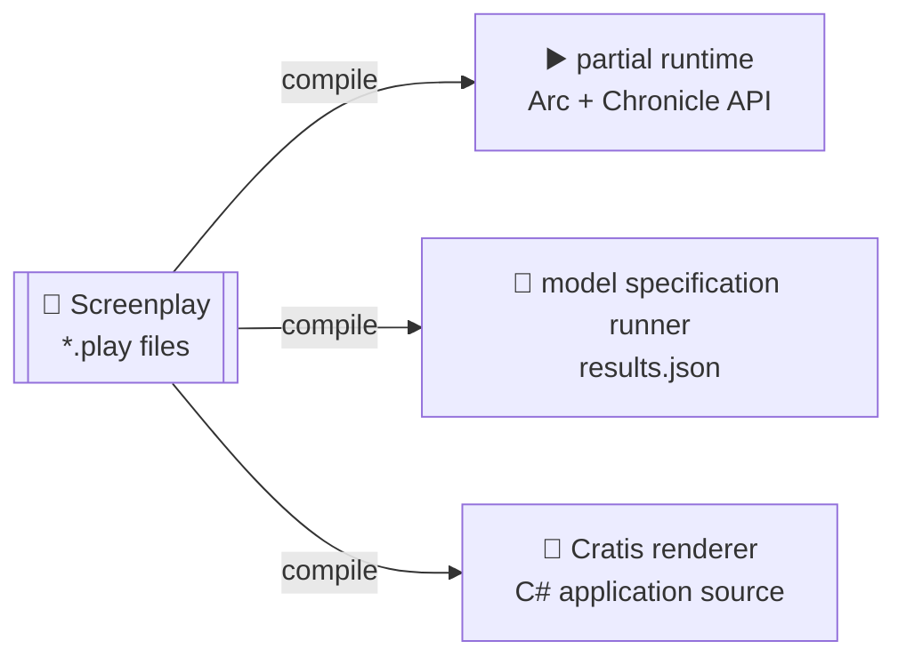

<!-- markdownlint-disable MD033 MD041 -->
<div align="center">

# ▶️ Cratis Stage

**Compiles Screenplay source, verifies modeled specifications, and renders or partially performs Cratis applications.**

[](https://discord.gg/kt4AMpV8WV)
[](https://hub.docker.com/r/cratis/stage)
[](https://github.com/Cratis/Stage/actions/workflows/dotnet-build.yml)
[](https://github.com/Cratis/Stage/actions/workflows/publish.yml)
[](LICENSE)

</div>

---

Stage has three responsibilities around a Screenplay application:

1. **Runtime** — provide a disposable host that directly performs the subset of modeled backend behavior Stage
   currently understands.
2. **Specification runner** — verify the specifications declared in the model and write structured results.
3. **Renderer** — turn compiled Screenplay syntax into a reviewable Cratis Arc + Chronicle application on disk.

The renderer is the project's highest-priority path. Direct runtime execution and specification verification are
useful, but partial; they must not be read as proof that every Screenplay construct has executable semantics.
Frontend and UI rendering are deferred.

## Authoritative input

The authoritative input is Screenplay source: a `.play` file or a folder containing `.play` files. The host and
specification runner recursively compile every `.play` file beneath the folder they receive and merge the
results. Stage's contract models are internal/tooling seams produced from that compilation; an
`event-model.json` file is not the current startup or rendering contract.


```mermaid
flowchart LR
    Play[["📄 Screenplay<br/>*.play files"]]
    Play -->|compile| Runtime["▶️ partial runtime<br/>Arc + Chronicle API"]
    Play -->|compile| Specs["🧪 model specification runner<br/>results.json"]
    Play -->|compile| Renderer["🎨 Cratis renderer<br/>C# application source"]
```

Stage is independent of Studio. Studio, the Cratis CLI, and other tooling can supply the same Screenplay source
without Stage depending on any one authoring environment.

## Current scope

### Renderer — highest priority

`Cratis.Stage.Rendering.Cratis` renders backend Cratis artifacts from compiled Screenplay applications,
including concepts, types, state changes, state views, reactions, authorization attributes, and specifications.
Role-only alternatives and authenticated-only authorization render exactly. Each generated query method carries
its own attribute; policies from distinct queries are never unioned on the read model. Conjunctions, claims,
authored code, missing policies, and mixed unsupported authorization raise `STAGE-AUTH-001` for the containing
artifact. The renderer continues independent work to collect diagnostics, then faults the operation with a typed
`RenderingFailed`; it prints `Rendering complete.` only after a run with no blocking failures.

The current filesystem output writes artifacts directly and has no managed staging, manifest, or safe stale-file
removal. A failed run therefore leaves the target **unsafe and incomplete**: files from an earlier run can remain,
including a physical copy of an artifact blocked by the current run. When it can do so without overwriting an
existing file, Stage creates `.stage-render-failed` as an advisory marker. The marker does not disable or delete
anything. Render failures into a fresh target and review the result before building, running, or deploying it.
Managed `ArtifactRenderPlan` commit semantics are deferred to Stage #56 and CLI #101.

Other model limitations are reported as render diagnostics. `Cratis.Stage.Rendering.Cratis.Scaffolding` can place
the output into a project created from the Cratis templates. Rendering currently targets the backend application.
Screens, layouts, forms, components, and other frontend/UI output are not rendered yet.

### Direct runtime — partial

The `cratis/stage` image is a disposable sandbox containing the Stage host and an in-memory Chronicle kernel. It
loads a folder of `.play` files and exposes the runtime surfaces Stage currently implements. This path is not a
complete executable implementation of the Screenplay language and should not be treated as a generated
production application.

Runtime commands evaluate their modeled `produces` mappings, append the resulting facts to Chronicle, and echo
the payload as the response. Modeled command validation and authorization are not yet enforced by this runtime
path.

Stage also does not yet receive an executable query authorization contract. Modeled query performers deny access
by default and return no data, so they cannot expose projected documents while authorization semantics are absent.
Full query authorization and query execution are blocked on the Screenplay-owned executable semantic/query model;
Stage does not invent an interim query DTO contract.

### Specification runner — model-level verification

`cratis/stage-specrunner` is a run-to-completion job. It compiles the `.play` files, checks the modeled
specifications against the model, writes `results.json`, and exits. Verification is currently model-level: it
checks the modeled facts and expectations but is not a substitute for behaviorally executing every slice against
a live runtime.

## Projects

| Project                               | Package / image                             | Purpose                                                                                                                                                              |
| ------------------------------------- | ------------------------------------------- | -------------------------------------------------------------------------------------------------------------------------------------------------------------------- |
| `Source/Contracts`                    | `Cratis.Stage.Contracts`                    | Contract models and converters produced from compiled Screenplay syntax, specification results, and Scene/render-plan contracts used by Stage tooling.               |
| `Source/Rendering.Cratis`             | `Cratis.Stage.Rendering.Cratis`             | Cratis-specific backend renderer with method-specific query authorization and explicit failed-operation signaling; direct-write targets remain unsafe after failure. |
| `Source/Rendering.Cratis.Scaffolding` | `Cratis.Stage.Rendering.Cratis.Scaffolding` | Optional Cratis template scaffolding around rendered source.                                                                                                         |
| `Source/Stage`                        | `Cratis.Stage`                              | Partial direct runtime engine: dynamic API types, command handling, Chronicle registration, specification strategies, and fail-closed modeled query performers.      |
| `Source/Host`                         | `cratis/stage`                              | Disposable HTTP host paired with an in-memory Chronicle kernel for direct runtime exploration.                                                                       |
| `Source/SpecRunner`                   | `cratis/stage-specrunner`                   | Container job for model-level specification verification and `results.json` output.                                                                                  |

## Running the sandbox

Mount a folder containing one or more `.play` files:

```bash
docker run --rm \
    -p 9090:9090 \
    -p 35000:35000 \
    -v "$PWD":/eventmodel \
    cratis/stage:latest
```

The Stage API is exposed on port `9090`; the Chronicle Workbench is exposed on port `35000`. The host takes the
model folder as its first argument. Deployment configuration is read from `cratis-stage.json`, with its path
overridable through `STAGE_CONFIG`.

## Running modeled specifications

```bash
docker run --rm \
    -v /path/to/screenplays:/model \
    -v /path/to/results:/output \
    cratis/stage-specrunner:latest
```

The runner accepts `--model <folder>` and `--output <file>`, with optional `--slice <guid>` and `--spec <guid>`
filters. The container defaults to `/model` and `/output/results.json`.

Full container, URL, specification-result, and render-plan documentation lives in
[Documentation](Documentation/index.md).

## Building

```shell
dotnet build -c Debug
dotnet test -c Debug
dotnet build -c Release
```

Release treats warnings as errors. Both Dockerfiles consume prebuilt, framework-dependent publish output;
`./dockerize.sh` publishes the host and specification runner and then builds both images.

---

<div align="center">

_Part of the [Cratis](https://cratis.io) platform · Licensed under the [MIT license](LICENSE)_

</div>
